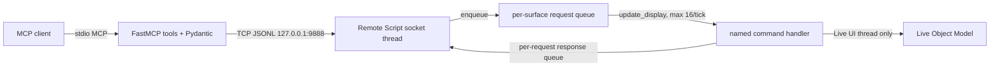

# Architecture

## Components

The repository contains two cooperating components:

1. `ableton_mcp_server/` is the stdio FastMCP server. It owns Pydantic validation, JSONL encoding, reconnect policy, local log reading, and snapshot diffing. It imports no Ableton module.
2. `AbletonMCPServer_RemoteScript/` runs inside Live. It owns the loopback socket, the main-thread request queue, command handlers, Live Object Model access, and undo grouping.

The shape follows the SDK-free port/adapter boundary demonstrated by [Loophole](https://github.com/OthmanAdi/loophole), adapted to a Python MIDI Remote Script host.

## Data Flow and Thread Safety



The socket thread parses JSON and waits for a response queue. It never reads or writes a Live object. `update_display` drains at most sixteen requests per tick to avoid monopolizing Live's UI thread.

## Socket Protocol

Every frame is UTF-8 JSON followed by `\n`. Frames larger than 1 MiB are rejected.

Request:

```json
{"type": "set_tempo", "params": {"tempo": 128.0}}
```

Success:

```json
{"status": "ok", "result": {"tempo": 128.0}}
```

Error:

```json
{
  "status": "error",
  "code": "PLAYHEAD_NOT_MOVED",
  "message": "Transport setter did not reach the requested value ...",
  "hint": "Live may be in a transitional state; retry after it settles."
}
```

The listener binds the literal `127.0.0.1`. It has no LAN mode.

## Error Model

| Code | Meaning | Recovery |
|---|---|---|
| `UNKNOWN_COMMAND` | Dispatcher has no such command. | Correct the tool/command name. |
| `INVALID_PARAMS` | Envelope or argument shape is invalid. | Fix the argument. |
| `READ_ONLY_VIOLATION` | An explicitly blocked creative mutation was requested. | Use an allowed debug tool. |
| `TIMEOUT` | The UI thread did not answer before the queue timeout. | Inspect Live before retrying mutations. |
| `LIVE_UNAVAILABLE` | Live rejected the operation or an expected host method is absent. | Inspect `Log.txt` and runtime version. |
| `INTERNAL_ERROR` | An unexpected batch handler failure occurred. | Inspect logs and report a reproduction. |
| `PLAYHEAD_NOT_MOVED` | Set/read verification failed after retries. | Let Live settle, inspect state, then retry. |
| `STALE_REFERENCE` | A path-id no longer resolves. | Re-list and use a fresh id. |
| `WRONG_TYPE` | The target exists but cannot perform that operation. | Select a matching track/clip type. |
| `BAD_INPUT` | A well-shaped argument is outside a safe domain. | Correct its value. |

`Client` maps remote errors to typed Python exceptions. It automatically retries reads after connection failure. It never automatically retries a mutation: a broken connection does not prove that Live failed to apply the write.

## Mutation Allowlist

`contracts.py` defines three disjoint sets:

- `READ_COMMANDS`: Remote Script reads.
- `ALLOWED_MUTATIONS`: transport, loop, cue, Session clip, MIDI-note, and batch debug operations.
- `READ_ONLY_COMMANDS`: creative/destructive operations that remain blocked.

There is no name-prefix rule. An unknown command reaches the dispatcher and returns `UNKNOWN_COMMAND`.

`contracts.py` is copied into `_contracts.py` by `python scripts/vendor_contracts.py`. The generated file has a stable header and identical remaining bytes. Live never imports the server package.

## Path-Id Scheme

Paths use `/`-joined index segments:

```text
track:2
track:2/device:1
track:2/device:1/param:3
track:2/clipslot:4
track:2/clipslot:4/clip
track:2/clip:0
```

Paths contain no Live handle and are JSON-safe. `list_device_params` resolves `track:N` against current Live state on every call. Missing targets return `STALE_REFERENCE`.

These paths are session-local locators, not persistent identities. If a track insertion shifts indexes, `track:2` refers to the new current track at index two. Agents must re-list after structural changes. No Live object is cached by the server.

## Transport Verification

`_set_transport_value(song, attribute, value)` receives the actual attribute name. It:

1. Saves and suspends clip-trigger quantization.
2. Calls `setattr(song, attribute, value)`.
3. Reads `float(getattr(song, attribute))`.
4. Compares with `0.01` beat tolerance.
5. Sleeps `0.01` seconds and retries, at most three writes.
6. Raises `PLAYHEAD_NOT_MOVED` when verification never succeeds.
7. Restores quantization in `finally`.

No callable identity comparison is involved. Cue toggle operations occur only after verified movement.

## Undo and Batch Semantics

Standalone mutations open and close one undo step. `run_batch` opens one outer step and invokes sub-handlers without nested undo steps.

The selected runtime object must expose `begin_undo_step()` and `end_undo_step()`. The Control Surface resolves this capability from the control-surface instance, `c_instance`, application, or song. If no target exposes both methods, the mutation fails with `LIVE_UNAVAILABLE` before changing the Set.

`run_batch` stops at the first error. Successful earlier commands remain applied inside the same undo step. `rolled_back` is always `false`; one Ctrl+Z reverts the grouped successful prefix. Reverse-operation replay is not attempted because it cannot restore every LOM mutation safely.

## State and Time Ownership

- MCP client: one process-global client, serialized by a lock for the server process lifetime.
- Request queue: one per enabled Control Surface.
- Response queue: one per JSONL request.
- Socket receive buffer: one per TCP connection.
- Mock state: one per mock server instance.
- Snapshot time: Unix epoch milliseconds from `time.time()`.
- Retry delays: duration seconds; never compared to epoch timestamps.

## FastMCP Tool Listing Compatibility

FastMCP 3.x exposes an async `list_tools()`. `CountableFastMCP` returns a lazy awaitable proxy that also implements `__len__`, so both forms work:

```python
tools = await mcp.list_tools()
count = len(mcp.list_tools())
```

Tests assert both counts match the 36 registered tools.

## Manual Live Verification

Automated tests prove handlers with LOM-shaped fakes, not the real Ableton runtime. After installation:

1. Confirm the control-surface message reports `127.0.0.1:9888`.
2. Run `python scripts\integration_check.py --port 9888`.
3. Call `get_session_info`, `get_track_list`, `take_snapshot`, and `get_ableton_logs` from an MCP client.
4. Enable verbose probes and create a cue at a known empty beat. Confirm the playhead is restored.
5. Repeat creation at the same beat with a different name. Confirm rename without deletion.
6. Create an empty MIDI clip, add one note, and fire it.
7. Run a successful two-command batch and confirm one Ctrl+Z reverts both.
8. Run a batch whose second command fails. Confirm the first mutation remains until one Ctrl+Z.
9. Confirm blocked `delete_track` returns `READ_ONLY_VIOLATION`.
10. Disable the Control Surface and confirm the port closes cleanly.
