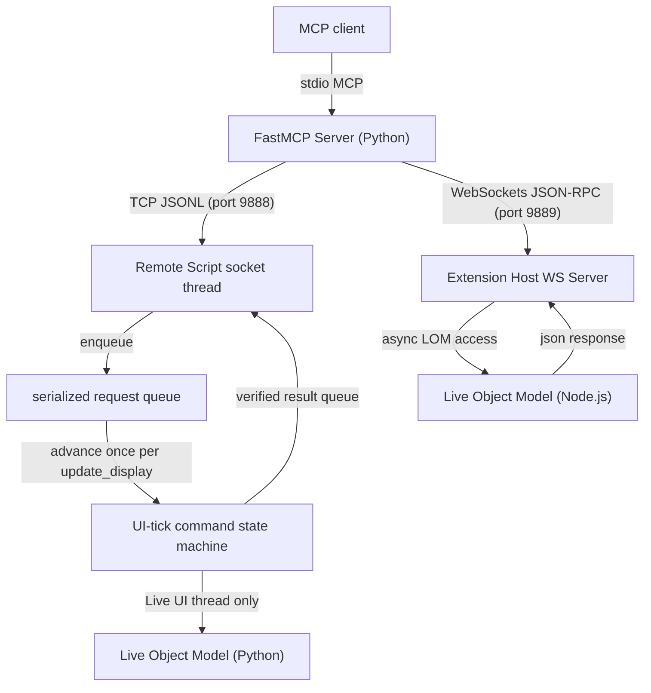

# Architecture

## Components

The repository contains three cooperating components:

1. `ableton_mcp_server/` is the stdio FastMCP server. It owns Pydantic validation, JSONL encoding, reconnect policy, local log reading, and snapshot diffing. It imports no Ableton module.
2. `AbletonMCPServer_RemoteScript/` runs inside Live. It owns the loopback socket, the main-thread request queue, command handlers, Live Object Model access, and undo grouping.
3. `AbletonMCPServer_Extension/` is the TypeScript Ableton Live Extension. It compiles into a `.ablx` file running inside the Node.js Extension Host, hosting a WebSocket server on port `9889` to expose warping properties and device insertion. Loopback use is required, and the Node server explicitly binds to `127.0.0.1`.

## Data Flow and Thread Safety



The socket thread for the Python Remote Script parses JSON and waits for a response queue. It never reads or writes a Live object. Reads and synchronous mutations can complete in one tick. Deferred mutations yield, let Live process its UI cycle, then read back state on a later tick. Requests are serialized while one deferred command is active, preserving command order and avoiding competing transport writes. Persistent connections remain open while idle; a one-second receive timeout only lets the thread observe shutdown.

The Node.js Extension Host operates asynchronously and concurrently, so requests can resolve natively using Javascript `async/await` without requiring a tick queue.

## Windows and WSL Process Topology

The Remote Script always binds `127.0.0.1:9888`. On Windows, the MCP process must therefore run in the Windows network namespace. A WSL MCP client launches `.venv-win/Scripts/ableton-mcp-server.exe` through standard WSL interoperability; stdio crosses the boundary while TCP remains Windows-local.

Native Linux Python inside WSL NAT is intentionally not made to work by binding Live to `0.0.0.0`. The JSONL protocol has no remote authentication or encryption, so LAN exposure would be unsafe. Mirrored WSL networking may make localhost work, but it is an optional environment configuration rather than the canonical deployment.

## Socket Protocol

Every frame is UTF-8 JSON followed by `\n`. Frames larger than 1 MiB are rejected.

Request:

```json
{"type": "set_tempo", "params": {"tempo": 128.0}}
```

Success:

```json
{"status": "ok", "result": {"tempo": 128.0}}
```

Error:

```json
{
  "status": "error",
  "code": "PLAYHEAD_NOT_MOVED",
  "message": "Transport setter did not reach the requested value ...",
  "hint": "Live may be in a transitional state; retry after it settles."
}
```

The listener binds the literal `127.0.0.1`. It has no LAN mode.

## Error Model

| Code | Meaning | Recovery |
|---|---|---|
| `UNKNOWN_COMMAND` | Dispatcher has no such command. | Correct the tool/command name. |
| `INVALID_PARAMS` | Envelope or argument shape is invalid. | Fix the argument. |
| `READ_ONLY_VIOLATION` | An explicitly blocked creative mutation was requested. | Use an allowed debug tool. |
| `TIMEOUT` | The UI thread did not answer before the queue timeout. | Inspect Live before retrying mutations. |
| `LIVE_UNAVAILABLE` | Live rejected the operation or an expected host method is absent. | Inspect `Log.txt` and runtime version. |
| `INTERNAL_ERROR` | An unexpected batch handler failure occurred. | Inspect logs and report a reproduction. |
| `PLAYHEAD_NOT_MOVED` | Set/read verification failed after retries. | Let Live settle, inspect state, then retry. |
| `STALE_REFERENCE` | A path-id no longer resolves. | Re-list and use a fresh id. |
| `WRONG_TYPE` | The target exists but cannot perform that operation. | Select a matching track/clip type. |
| `BAD_INPUT` | A well-shaped argument is outside a safe domain. | Correct its value. |
| `EXTENSION_UNAVAILABLE` | Extension Host WebSocket bridge is not reachable. | Ensure the AbletonMCPServer extension is compiled and loaded. |
| `TRACK_LIMIT_REACHED` | The 96 track safety limit has been hit. | Remove unused tracks. |

`Client` maps remote errors and socket failures to typed Python exceptions. At the FastMCP boundary, expected bridge exceptions become typed MCP error results rather than internal framework failures. Empty arrays receive both structured `[]` data and a textual `[]` fallback for clients that ignore structured content.

The client automatically retries reads after connection failure. It never automatically retries a mutation: a broken connection does not prove that Live failed to apply the write. Client and Remote Script compute the same deadline from `contracts.request_timeout_seconds`; the 20-second base scales by serialized bulk/batch work units.

## v0.5.0 set lifecycle, fader fade, and offline mix analysis

The public surface contains 65 tools. Nine v0.5.0 tools add a read-only `lifecycle_status` probe, `save_set` / `quit_ableton` lifecycle mutations with scheduled GUI fallback, `live_fade` smoothstep/linear interpolation that distributes writes across `duration` seconds via `time.monotonic` and yields to `Song.update_display` between steps (no `time.sleep`, never blocks the Live main thread), `create_audio_track` mirroring `create_midi_track`, and a `ableton_mcp_server.analysis` package of four offline mix analysis tools (`analyze_audio`, `find_frequency_masking`, `analyze_mix`, `extract_single_cycle`) that are dependency-free of Live and the bridge.

`lifecycle_status` is registered in `READ_COMMANDS` and therefore bypasses the mutation allowlist. The other three lifecycle tools (`save_set`, `quit_ableton`, `live_fade`) and `create_audio_track` are explicit `ALLOWED_MUTATIONS`. Mix analysis tools touch only the local filesystem and never touch the Set.

`live_fade` runs its steps inside `Song.update_display` ticks — `time.sleep` is intentionally not used — and is bounded by a 60-second timeout override plus `min(60, steps + 1)` work units. The runtime identity tag added to `get_bridge_status` (`set-lifecycle-and-fade-1`) lets consumers distinguish which feature set a given server is running.

## v0.4.0 routing and capability boundaries

The public surface contains 56 tools. Ten v0.4.0 tools add verified parameter writes, Session detail/overview, bounded Browser search, clip/scene mutations, verified properties, and Session clip automation.

`search_browser` is a TCP read because the Remote Script already owns `application.browser`. Traversal state is per request and bounded by depth, children, visited objects, and result count. `get_session_overview` is local MCP composition of three existing reads and therefore has no remote contract row. `load_device_to_track` remains the existing WebSocket method; it is not duplicated on TCP.

Device parameter writes resolve exact LOM parameters, enforce enabled state and bounds, then write/yield/read back with one retry. Quantized parameters return Live's observed quantized value. Session clip automation is capability-gated: it resolves mixer aliases or exact device parameters, clears only the selected envelope, inserts sorted breakpoints, yields, and requires observable envelope state. Arrangement and track automation remain out of scope.

Optional MIDI note expression fields are passed to `Live.Clip.MidiNoteSpecification` only when requested. A host that cannot construct the requested extended specification returns `LIVE_UNAVAILABLE`; fields are never silently discarded.

## Mutation Allowlist

`contracts.py` defines three disjoint sets:

- `READ_COMMANDS`: Remote Script reads.
- `ALLOWED_MUTATIONS`: transport, loop, cue, Session clip, MIDI-note, and batch debug operations.
- `READ_ONLY_COMMANDS`: creative/destructive operations that remain blocked.

There is no name-prefix rule. An unknown command reaches the dispatcher and returns `UNKNOWN_COMMAND`.

`contracts.py` is copied into `_contracts.py` by `python scripts/vendor_contracts.py`. The generated file has a stable header and identical remaining bytes. Live never imports the server package.

## Path-Id Scheme

Paths use `/`-joined index segments:

```text
track:2
track:2/device:1
track:2/device:1/param:3
track:2/clipslot:4
track:2/clipslot:4/clip
track:2/clip:0
```

Paths contain no Live handle and are JSON-safe. `list_device_params` resolves `track:N` against current Live state on every call. Missing targets return `STALE_REFERENCE`.

These paths are session-local locators, not persistent identities. If a track insertion shifts indexes, `track:2` refers to the new current track at index two. Agents must re-list after structural changes. No Live object is cached by the server.

## Transport Verification

Transport setters return step generators. Each attempt:

1. writes the requested property on Live's UI thread;
2. yields without sleeping or responding to the socket;
3. reads the observed property on a later `update_display` tick;
4. compares numeric state with `0.01` tolerance or boolean state exactly;
5. retries for at most ten UI ticks;
6. returns only the observed value, or raises a typed error.

Playhead writes suspend and restore clip-trigger quantization in `finally`. Start/stop playback, tempo, loop enablement, loop start, and loop length use the same deferred confirmation model.

Cue operations are multiphase. They move and verify `current_song_time`, the official LOM's “current Arrangement playback position”, snapshot locator state, invoke the toggle exactly once, and observe the resulting delta across UI ticks. Live 12.4.5b7 can snap this call to the Arrangement editing grid independently of clip-trigger quantization. An off-grid toggle is reversed before returning `CUE_SNAPPED_TO_GRID`; if it temporarily removed an existing locator, that locator and its name are restored. `Song.start_time` is intentionally untouched because it controls where playback will start. Names are read back and idempotently retried before success. Single operations finally restore the prior playback position. Bulk creation shares one position scope and restores once after all items, reducing UI writes and timeout pressure.

Python MIDI Remote Scripts do not use the Max LOM dictionary binding for `Clip.add_new_notes`. The handler creates a tuple of `Live.Clip.MidiNoteSpecification` objects and passes that tuple to the Python LOM method.

## Undo and Batch Semantics

Standalone mutations open and close one undo step. `run_batch` opens one outer step and invokes sub-handlers without nested undo steps.

The selected runtime object must expose `begin_undo_step()` and `end_undo_step()`. The Control Surface resolves this capability from the control-surface instance, `c_instance`, application, or song. If no target exposes both methods, the mutation fails with `LIVE_UNAVAILABLE` before changing the Set.

`run_batch` stops at the first error. Successful earlier commands remain applied inside the same undo step. `rolled_back` is always `false`; one Ctrl+Z reverts the grouped successful prefix. Reverse-operation replay is not attempted because it cannot restore every LOM mutation safely.

## State and Time Ownership

- MCP client: one process-global client, serialized by a lock for the server process lifetime.
- Request queue: one per enabled Control Surface.
- Response queue: one per JSONL request.
- Socket receive buffer: one per TCP connection.
- Mock state: one per mock server instance.
- Snapshot time: Unix epoch milliseconds from `time.time()`.
- Deferred attempts: UI ticks, with no sleep or busy-wait on Live's main thread.

## FastMCP Tool Listing Compatibility

FastMCP 3.x exposes an async `list_tools()`. `CountableFastMCP` returns a lazy awaitable proxy that also implements `__len__`, so both forms work:

```python
tools = await mcp.list_tools()
count = len(mcp.list_tools())
```

Tests assert both counts match the 65 cataloged public tools.

`tools/list` remains deterministic metadata discovery. `get_bridge_status` and the `ableton-mcp doctor` CLI perform an actual `get_session_info` round trip and report WSL-specific topology hints when unavailable.

## Live Acceptance Verification

Unit and socket tests are supplemented by a guarded real-Live runner. It refuses mutation unless `get_project_metadata.song_name` exactly matches `--confirm-project-name`, the selected track is MIDI, and the selected slot is empty. It then verifies transport, loop state, exact cue round trips, Python-LOM MIDI notes, clip firing, and partial-batch behavior before restoring transport and loop state.

```powershell
ableton-mcp acceptance --confirm-project-name TESTE_CODEX --track-index 0 --clip-index 3 --fire-clip --json
```

The created Session clip remains intentionally; run only against a disposable Set.

## Slice 1 Stabilization Contract (v0.5.0)

The certified baseline surface freezes these contracts; Slice 2 will expand
without breaking them:

- 65 catalogued public tools; `tool_count` is the single source of truth.
- Two loopback transports, desktop-only: TCP `127.0.0.1:9888` for the Remote
  Script and WebSocket `127.0.0.1:9889` for the Extension. No LAN mode.
- `load_device_to_track` takes a primary `device_name` argument;
  `device_uri` is retained as a deprecated alias for one release cycle.
- Warp markers are **read-only**: `get_warp_state` exposes the array, but
  `set_warp_state` rejects `warp_markers` writes at the model layer.
- Stable cross-bridge error taxonomy: `CAPABILITY_UNAVAILABLE`,
  `AMBIGUOUS_MATCH`, `VERIFICATION_FAILED`, `ACCEPTANCE_GUARD_FAILED`
  join the long-standing transport codes (`INVALID_PARAMS`,
  `LIVE_UNAVAILABLE`, `STALE_REFERENCE`, `READ_ONLY_VIOLATION`, ...).
  See `ableton_mcp_server.errors` for the full list.
- Per-tool certification statuses (`offline_passed`, `live_passed`,
  `manual_passed`, `host_unavailable`, `environment_unavailable`,
  `failed`) are produced by `cli acceptance --profile baseline` and gate
  the release decision. A baseline certification is only declared
  **certified** after this gated Live run finishes with zero `failed`
  rows.
- The WebSocket bridge (Extension Host) binds explicitly to
  `127.0.0.1:9889`. The TCP bridge remains on `127.0.0.1:9888`. LAN
  exposure is forbidden by design.
- The guarded `acceptance --confirm-project-name TESTE_CODEX` command is
  the only path that runs mutations against a real Live Set.
- Node.js is required only for Extension development; the Python wheel
  installs and runs without it. Clean install probe:
  `scripts/verify_clean_install.ps1`.
